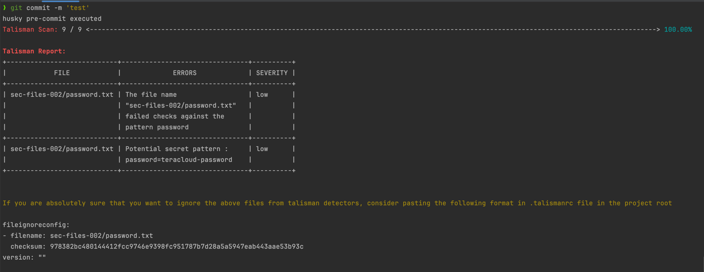

# Talisman Workshop

Welcome to the Talisman workshop, this workshop will teach you step-by-step how to setup Talisman application
and scan for secret, credential or any password in the source code.

### Prerequisite

- Node LTS
- [Husky](https://typicode.github.io/husky/getting-started.html#automatic-recommended)

### Step-by-Step Talisman & Husky

- 1.) Install the Talisman
  ```shell
  curl https://thoughtworks.github.io/talisman/install.sh > ~/install-talisman.sh 
  chmod +x ~/install-talisman.sh
  ```
  NOTE: Make sure to set up the `TALISMAN_HOME` properly


- 2.) Install pre-commit hook`
  ```shell
  ~/install-talisman.sh pre-commit
  ```

- 3.) Adding files with credentials
  ```shell
  mkdir sec-files-002 && cd sec-files-002 
  echo "username=teracloud-user" > username
  echo "password=teracloud-password" > password.txt
  echo "apiKey=aPPs32988sab21SA1221vdsXeTYY_243" > ultrasecret
  echo "base64encodedsecret=aPPs32988sss67SA1229vdsXeTXY_27777==" > secret
  ```

- 4.) Add files and commit, then you should see error and block your git push
  ```shell
  cd ..
  git add .
  git commit -m "commit password files"
  ```

- 5.) The Talisman will report files that contains credentials
  

### Useful Links

- [Talisman's website](https://thoughtworks.github.io/talisman/)
- [Talisman Github](https://github.com/thoughtworks/talisman)

### Troubleshooting

- [error:0308010C:digital envelope routines::unsupported](https://stackoverflow.com/questions/69692842/error-message-error0308010cdigital-envelope-routinesunsupported)
