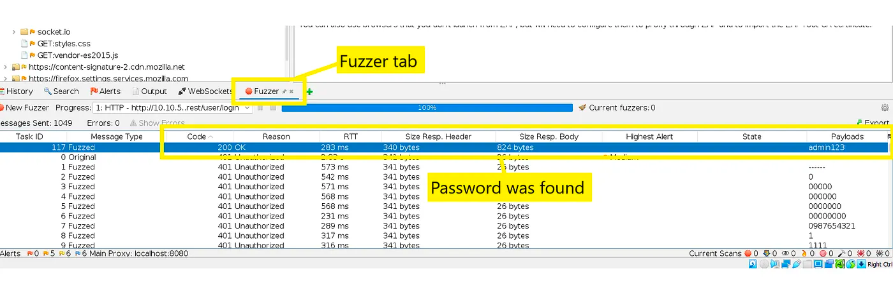

# OWASP Zap

Welcome to the OWASP Zap workshop, this workshop will teach you step-by-step how to setup OWASP Zap application
and perform exploratory security testing, to find the `admin's password`

### Prerequisite

- [Wordlist best 1050](https://github.com/danielmiessler/SecLists/blob/master/Passwords/Common-Credentials/best1050.txt)
- Looking for admin activity on the juice shop side, and try to find admin email
  
- Admin email: `admin@juice-sh.op`

### Step-by-Step

- 1.) Install the application [OWASP Zap](https://www.zaproxy.org/download/)

- 2.) Start the OWASP Zap with `Manual explore` mode
  

- 3.) Enter the juice shop's site URL `https://juice-shop.herokuapp.com/#` and lunch browser
  

- 4.) Try to login on the with admin's email and looking for the API endpoint `rest/user/login` that use for
  authentication
  

- 5.) Try to bruteforce password via login endpoint using the provided wordlist
    - 5.1) 

    - 5.2) 

    - 5.3) 

    - 5.4) 

    - 5.5) 

    - 5.6) 

    - 5.7) 

    - 5.8) 
  
    - 5.9) 

### Troubleshooting

- [Browser was not found](https://www.zaproxy.org/faq/how-can-i-fix-browser-was-not-found/)
